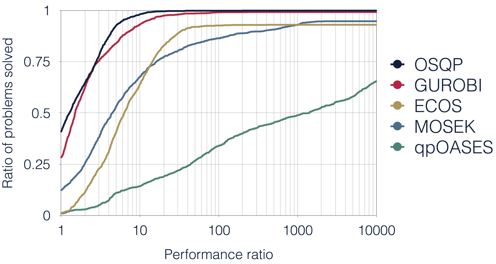
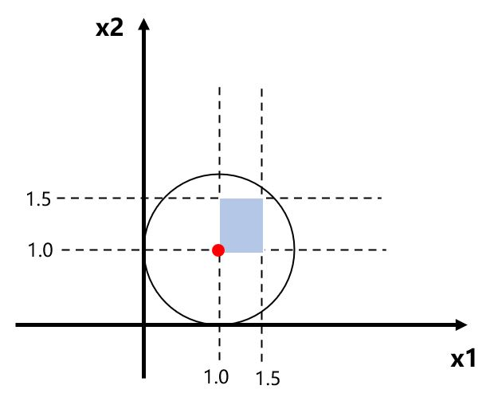

# 利用OSQP库计算标准二次规划(QP)问题的实例
[TOC]
## OSQP介绍
Apollo使用的二次规划求解使用的为OSQP,因此调查试用了一下.
由于github不支持公式,完整版请参照README.pdf.

### [OSQP官网](https://osqp.org/)介绍,特点如下:
* Efficient
采用了`ADMM-based first-order`算法(待学习)
* Robust
只需要问题本身为凸即可,对问题数据无要求(求解需要的problem data指的是?)
* Free
Apache 2.0 license
* Embaddable
生成嵌入式C代码,不需要管理内存
* Interface
多语言,跨平台,支持C/C++, Fortran, Matlab, Python, R, Julia, Rust.
* Library-Free
无需安装依赖

* 同类bechmark如下图


### Ubuntu部署
参照[官网](https://osqp.org/docs/get_started/sources.html#build-from-sources)说明即可.
由于Binary网页无法打开,使用源码安装方式.
预先安装`gcc`与`cmake`.[代码](https://github.com/osqp/osqp)下载后,cmake-make-make install.

### C++接口
官方无C++接口,有两个推荐的第三方维护的接口:*google*的[osqp-cpp](https://github.com/google/osqp-cpp)与*GiulioRomualdi*的[osqp-eigen](https://github.com/robotology/osqp-eigen). **osqp-cpp**为**osqp-eigen**的类似.区别如下:
1. license
osqp-cpp为MIT(最宽松),osqp-eigen为LGPL(传染式开源).关于开源证书可以参考[知乎回答](https://zhuanlan.zhihu.com/p/87855729).
2. 两者除都依赖Eigen以外,osqp-cpp依赖google自家的abseil-cpp库.osqp-eigen没有其他依赖.

通过例子可以看出两者语法类似,为方便,本次实例采用了osqp-eigen.如果公司不能开源代码,可能需要使用osqp-cpp.另外注意一点,osqp-cpp不是offical supprted.

### osqp-eigen部署与使用
按照官方说明安装即可,cmake-make-make install.
cmakelist示例:
```
cmake_minimum_required(VERSION 3.0)
project(myproject)
find_package(OsqpEigen REQUIRED)
add_executable(example example.cpp)
target_link_libraries(example OsqpEigen::OsqpEigen)
```

## 标准问题构建
$min$ 
$$  \frac{1}{2}X^TPX+Q^TX $$
$s.t.$ 
$$ L<=AX<=U $$
$X$为$n \times 1$向量
$A$为$m \times n$约束矩阵,约束条件个数为$m$个
其中$P$为Hessian正定矩阵($n\times n$对称矩阵)
$L$与$U$分别为上下限线性约束条件.

实际问题如下:
$min$ 
$$ (x_1-1)^2+(x_2-1)^2$$
$s.t.$ 
$$ 1<=x_1<=1.5 \\ 1<=x_2<=1.5 $$

图解下图


显而易见,最优解为$$ \begin{bmatrix} 1.0 \\ 1.0\end{bmatrix}$$
转化成矩阵形式:
$min$ 
$$ \frac{1}{2}X^T
                \begin{bmatrix}
                        2 & 0 \\
                        0 & 2\end{bmatrix}
                        X + 
                        \begin{bmatrix}
                        -2 & -2\end{bmatrix}
                        X$$
$s.t.$ 
$$ \begin{bmatrix}
        1\\
        1\end{bmatrix}
    <=
    \begin{bmatrix}
        1&0\\
        0&1\end{bmatrix}
    X<=
    \begin{bmatrix}
        1.5\\
        1.5\end{bmatrix}$$
由此可得$P,Q,A,L,U$.

## 求解示例代码
```
// osqp-eigen
#include "OsqpEigen/OsqpEigen.h"

// eigen
#include <Eigen/Dense>
#include <iostream>

int main()
{
    // allocate QP problem matrices and vectores
    Eigen::SparseMatrix<double> hessian(2, 2);      //P: n*n正定矩阵,必须为稀疏矩阵SparseMatrix
    Eigen::VectorXd gradient(2);                    //Q: n*1向量
    Eigen::SparseMatrix<double> linearMatrix(2, 2); //A: m*n矩阵,必须为稀疏矩阵SparseMatrix
    Eigen::VectorXd lowerBound(2);                  //L: m*1下限向量
    Eigen::VectorXd upperBound(2);                  //U: m*1上限向量

    hessian.insert(0, 0) = 2.0; //注意稀疏矩阵的初始化方式,无法使用<<初始化
    hessian.insert(1, 1) = 2.0;
    // std::cout << "hessian:" << std::endl
    //           << hessian << std::endl;
    gradient << -2, -2;
    linearMatrix.insert(0, 0) = 1.0; //注意稀疏矩阵的初始化方式,无法使用<<初始化
    linearMatrix.insert(1, 1) = 1.0;
    // std::cout << "linearMatrix:" << std::endl
    //           << linearMatrix << std::endl;
    lowerBound << 1, 1;
    upperBound << 1.5, 1.5;

    // instantiate the solver
    OsqpEigen::Solver solver;

    // settings
    solver.settings()->setVerbosity(false);
    solver.settings()->setWarmStart(true);

    // set the initial data of the QP solver
    solver.data()->setNumberOfVariables(2);   //变量数n
    solver.data()->setNumberOfConstraints(2); //约束数m
    if (!solver.data()->setHessianMatrix(hessian))
        return 1;
    if (!solver.data()->setGradient(gradient))
        return 1;
    if (!solver.data()->setLinearConstraintsMatrix(linearMatrix))
        return 1;
    if (!solver.data()->setLowerBound(lowerBound))
        return 1;
    if (!solver.data()->setUpperBound(upperBound))
        return 1;

    // instantiate the solver
    if (!solver.initSolver())
        return 1;

    Eigen::VectorXd QPSolution;

    // solve the QP problem
    if (!solver.solve())
    {
        return 1;
    }

    QPSolution = solver.getSolution();
    std::cout << "QPSolution" << std::endl
              << QPSolution << std::endl; //输出为m*1的向量
    return 0;
}
```
完整工程请参考[github](https://github.com/xinchu911/osqp_demo)

运算输出结果为
```
QPSolution
1.0003
1.0003
```
与最优解误差很小.

* 注意点:
  1. Eigen::SparseMatrix的初始化方式与一般Matrix不同,有两种方式:一是创建一个元素类型为`triplets`的列表,然后再将其转换为稀疏矩阵.二是调用稀疏矩阵的成员函数`.insert()`直接插入数值.稀疏矩阵的介绍可参考[博文](http://zhaoxuhui.top/blog/2019/08/28/eigen-note-3.html).
  2. 需要保证`NumberOfVariables`与`NumberOfConstraints`跟Hessian矩阵等维数对应上.